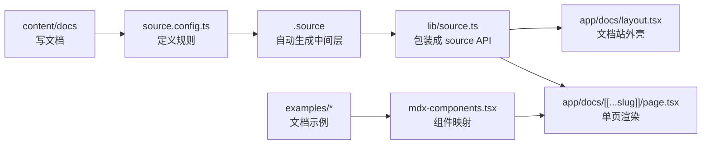
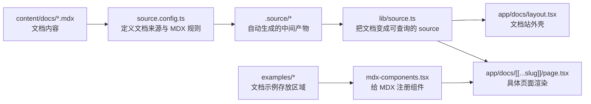
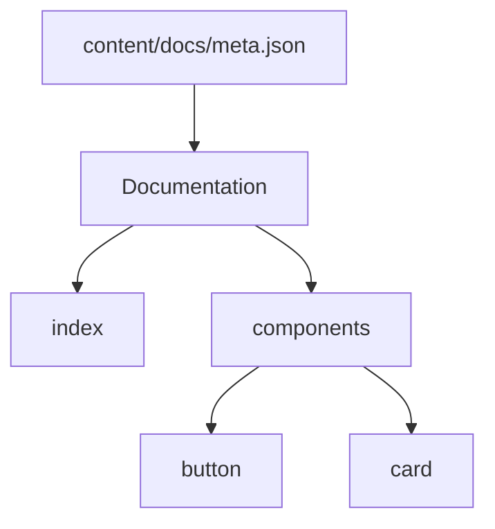
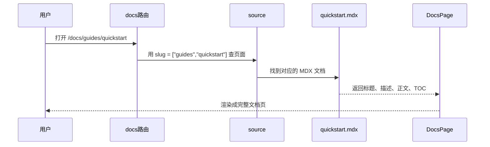
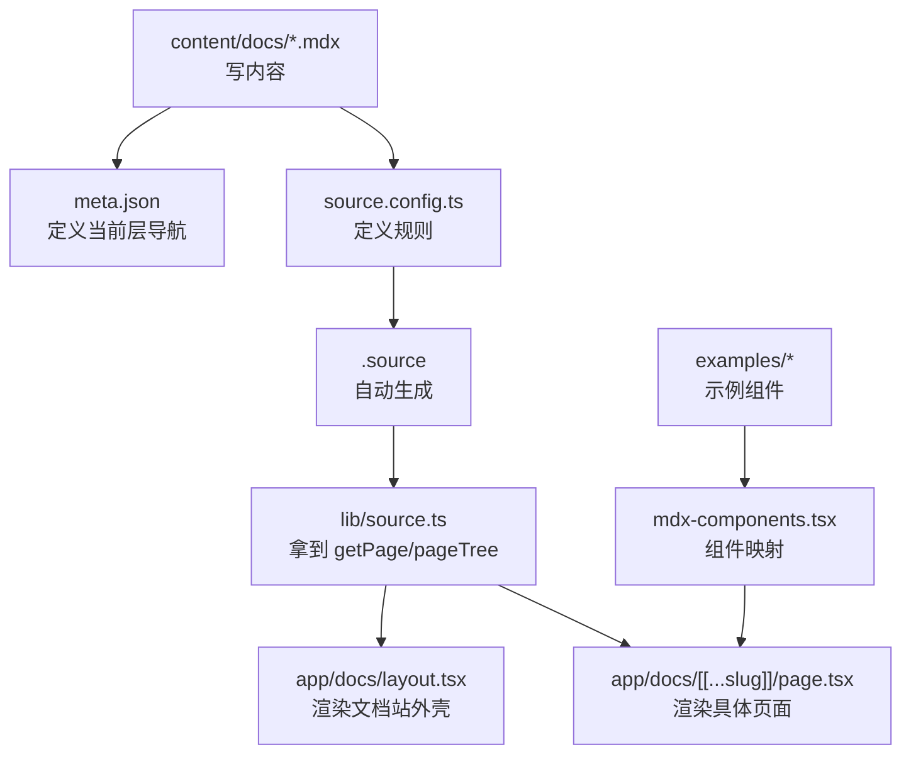

# Fumadocs 基础概念：从内容源到页面渲染

## 简介

`Fumadocs` 是一个围绕 `Next.js App Router` 构建的文档系统方案。它并不只是“一个文档主题”，而是一套从内容组织、内容索引、路由集成到页面展示的完整能力组合。

严格一点说，它通常是这几部分组合在一起：

- `fumadocs-core`
- `fumadocs-ui`
- `fumadocs-mdx` 或其他内容源
- `Next.js App Router`

所以它更适合被理解成“文档系统组合方案”，而不是单一的黑盒框架。

如果用一句话来概括：

**Fumadocs = 内容文件 + 内容索引 + 页面外壳 + 页面渲染**

对于刚开始接触 Fumadocs 的同学来说，最难的往往不是 API 本身，而是搞清楚：

- 文档内容到底放在哪里
- `.source` 是什么
- `source.config.ts` 和 `lib/source.ts` 分别做什么
- `meta.json` 如何影响左侧导航
- `mdx-components.tsx` 又是怎么把组件接进文档的

这篇文章会按照实际项目中的接入链路，把这些基础概念串起来。

## 阅读前先建立一个整体印象

如果你现在还没完全记住每个文件名，也没关系，先把它当成一条流水线就够了：



后面所有概念，基本都可以放回这张图里理解。

## 一、Fumadocs 的组成

### 1. Fumadocs Core

`fumadocs-core` 负责比较底层的内容源和文档能力，例如：

- Source API
- 页面树（page tree）
- TOC 相关基础能力
- 内容处理相关逻辑

可以把它理解成“文档系统的核心引擎层”。

### 2. Fumadocs UI

`fumadocs-ui` 提供默认的文档站外观和交互组件，例如：

- `DocsLayout`
- `DocsPage`
- `Callout`
- `Cards`
- `Tabs`
- `Files / Folder / File`
- TOC UI

可以把它理解成“文档站的默认展示层”。

### 3. Content Source

Fumadocs 需要一个内容源来告诉系统“文档内容从哪里来”。

常见来源包括：

- 本地 MDX
- CMS
- Content Collections
- 其他自定义数据层

在本文对应的项目里，使用的是 **Fumadocs MDX**，也就是本地 `content/docs` 目录。

### 4. Fumadocs CLI

CLI 主要用于安装 UI 组件、辅助初始化和一些自动化操作。它不是文档站运行的核心链路，但在搭建和扩展时很有帮助。

对新手来说，可以优先记住它常见的几类用途：

- `add`：安装或添加文档 UI 组件
- `customise`：帮助生成或定制布局
- `tree`：为 `Files / Folder / File` 这种目录展示组件生成树形数据

## 二、一句话理解 Fumadocs 的工作流

整体可以用下面这张图来理解：



这里面最重要的不是死记每个文件名，而是理解这条链路的顺序：

1. 先有文档内容
2. 再有内容源配置
3. 然后自动生成中间层
4. 再把中间层包装成 source
5. 最后由 Next.js 路由和页面去消费

如果你想用一句最实用的话记住这条链路，可以记成：

`source.config.ts -> .source -> lib/source.ts -> app/docs/layout.tsx -> app/docs/[[...slug]]/page.tsx`

### 一个最小可运行示例

如果你更习惯通过代码来理解，可以先看这组最小链路：

```ts
// source.config.ts
import { defineConfig, defineDocs } from "fumadocs-mdx/config";

export const docs = defineDocs({
  dir: "content/docs",
});

export default defineConfig({});
```

```ts
// lib/source.ts
import { loader } from "fumadocs-core/source";
import { docs } from "../.source/server";

export const source = loader({
  baseUrl: "/docs",
  source: docs.toFumadocsSource(),
});
```

```tsx
// app/docs/layout.tsx
import { DocsLayout } from "fumadocs-ui/layouts/docs";
import { source } from "@/lib/source";

export default function Layout({ children }: { children: React.ReactNode }) {
  return <DocsLayout tree={source.pageTree}>{children}</DocsLayout>;
}
```

```tsx
// app/docs/[[...slug]]/page.tsx
import { DocsPage } from "fumadocs-ui/page";
import { source } from "@/lib/source";

export default async function Page({
  params,
}: {
  params: Promise<{ slug?: string[] }>;
}) {
  const { slug } = await params;
  const page = source.getPage(slug);

  if (!page) return null;

  const Content = page.data.body;

  return (
    <DocsPage toc={page.data.toc}>
      <Content />
    </DocsPage>
  );
}
```

这四段代码合起来，就已经构成了一条完整的 docs 渲染链路。

## 三、核心目录与文件

在一个基于 Fumadocs + Next.js App Router 的项目里，通常会看到这些关键目录或文件：

- `content/docs`
- `meta.json`
- `source.config.ts`
- `.source`
- `lib/source.ts`
- `app/docs/layout.tsx`
- `app/docs/[[...slug]]/page.tsx`
- `mdx-components.tsx`
- `examples/*`

下面分别解释。

## 三、在进入细节前，先记住三句话

如果你只想先抓住最核心的东西，可以先记住这三句：

1. `content/docs` 放的是文档正文
2. `.source` 是自动生成的，不是手写的
3. `lib/source.ts` 才是页面真正消费的运行时入口

## 四、`content/docs` 与 `meta.json`

### 1. `content/docs` 是什么

`content/docs` 是文档正文的存放区域。

真正的页面内容一般写在：

- `index.mdx`
- `overview.mdx`
- `button.mdx`
- `quickstart.mdx`

这些 `.mdx` 文件就是最终会被渲染为文档页面的内容。

### 2. `.mdx` 是什么

`.mdx` 可以理解成：

**Markdown + React 组件**

这意味着你既可以写普通文档，也可以在文档中直接插入：

- `Callout`
- `Tabs`
- `Files`
- 自定义 example 组件

所以它特别适合写组件文档、API 文档和带交互示例的说明页。

### 3. `meta.json` 是什么

`meta.json` 不是正文内容，它更像是：

**当前这一层目录的导航说明书**

在当前版本里，它常见可配置项包括：

- `title`
- `icon`
- `description`
- `defaultOpen`
- `collapsible`
- `root`
- `pages`

其中最常用的仍然是 `title` 和 `pages`。

它主要负责：

- 定义当前 section 的标题
- 控制当前层直接孩子节点的顺序
- 参与构建左侧导航的 `pageTree`

例如：

```json
{
  "title": "Components",
  "pages": ["button", "card"]
}
```

这表示：

- 当前层展示标题叫 `Components`
- 这一层的直接孩子顺序是 `button -> card`

这里有一个非常重要的理解点：

**`pages` 应该优先理解成“当前层的直接孩子”，而不是跨层随便引用。**

也就是说：

- 同目录下的 `.mdx` 页面属于同一层
- 同目录下的子文件夹也属于当前层的子节点
- `meta.json` 只负责当前层，不负责越级组织整棵树

进阶一点看，`pages` 还可以支持一些更高级的写法，比如分隔线、链接和部分特殊约定；但对于入门阶段，先把它理解成“当前层的直接孩子顺序表”最稳妥。

### 4. 一个基本结构示例

```text
content/
  docs/
    index.mdx
    meta.json
    components/
      button.mdx
      card.mdx
      meta.json
```

根级 `meta.json` 负责根级导航；  
`components/meta.json` 负责 `components/` 这一层的导航。

### 用图理解 `meta.json` 对导航的影响



你可以把它理解成：

- 文件夹结构决定层级
- `meta.json` 决定这一层叫什么、怎么排序

详见官方页面约定文档：

- [Page Conventions / Meta](https://www.fumadocs.dev/docs/headless/page-conventions#meta)

## 五、`source.config.ts`、`.source`、`lib/source.ts`

这三个文件是最容易混淆的部分，但实际上它们的职责是串联起来的。

### 1. `source.config.ts`：定义规则

`source.config.ts` 是 Fumadocs 的内容源配置入口。

它的职责包括：

- 告诉系统文档目录在哪里
- 定义 docs collection
- 配置 MDX 的处理规则
- 配置代码高亮等全局 MDX 选项

一个典型结构如下：

```ts
import { defineConfig, defineDocs } from "fumadocs-mdx/config";

export const docs = defineDocs({
  dir: "content/docs",
});

export default defineConfig({
  mdxOptions: {
    rehypeCodeOptions: {
      themes: {
        light: "github-light",
        dark: "github-dark",
      },
    },
  },
});
```

如果你需要更严格的 frontmatter 校验，也可以在这里配置 schema、postprocess 等高级选项。

所以更准确地说：

**`source.config.ts` 负责定义“扫描和处理文档的规则”。**

#### 什么时候会改它

你通常会在下面这些场景下修改 `source.config.ts`：

- 修改文档根目录
- 给 frontmatter 增加 schema 校验
- 调整 MDX 处理规则
- 配置代码高亮主题
- 增加 remark / rehype 处理逻辑

### 2. `.source`：自动生成的中间层

当执行：

- `pnpm dev`
- `pnpm build`

并且项目已经通过 `createMDX()` 接入 Fumadocs MDX 后，系统会自动生成 `.source` 目录。

它通常包含：

- `server.ts`
- `browser.ts`
- `dynamic.ts`

这些文件的作用不是给你手写，而是把：

- `source.config.ts` 里的配置
- `content/docs` 里的扫描结果

整理成可直接 import 的映射文件。

因此最好的理解方式是：

**`.source` 是编译产物，是中间层，不建议手改。**

这里有一个容易写错的地方：

`.source` 的生成，主要来自 `source.config.ts` 和 `createMDX()` 这条链路；  
`lib/source.ts` 是消费 `.source` 的，不是负责生成 `.source` 的。

#### 用一句话区分这三个文件

- `source.config.ts`：规则定义处
- `.source`：规则执行后的生成结果
- `lib/source.ts`：运行时消费入口

### 3. `lib/source.ts`：运行时的 source 入口

`lib/source.ts` 的职责是：

**把自动生成的 docs 集合包装成站点运行时真正使用的 source 对象。**

示例：

```ts
import { loader } from "fumadocs-core/source";
import { docs } from "../.source/server";

export const source = loader({
  baseUrl: "/docs",
  source: docs.toFumadocsSource(),
});
```

这里要重点理解两件事：

#### 第一，`docs` 从哪里来

`docs` 来自 `.source/server`，它已经是按照 `source.config.ts` 规则整理好的 docs 集合。

#### 第二，`loader()` 做了什么

`loader()` 不负责扫目录，它负责消费一个已经准备好的 source，并生成这些能力：

- `getPage()`
- `getPages()`
- `pageTree`
- `generateParams()`

#### 这几个能力分别干嘛

```ts
const allPages = source.getPages();
const onePage = source.getPage(["components", "button"]);
const tree = source.pageTree;
const params = source.generateParams();
```

你可以把它们理解成：

- `getPages()`：拿到所有页面
- `getPage()`：根据 slug 取某一页
- `pageTree`：左侧导航树
- `generateParams()`：给 Next.js 静态生成页面参数

也就是说：

- `source.config.ts`：定义规则
- `.source`：自动生成中间层
- `lib/source.ts`：把中间层转成站点运行时 API

### 4. 文档内容访问图解

当用户打开 `/docs/guides/quickstart` 时，大致链路如下：



如果把这张图翻译成更口语的话，就是：

1. 用户访问一个 docs 路由
2. 路由把 slug 交给 `source`
3. `source` 找到对应的文档内容
4. 页面组件把这篇文档渲染出来

## 六、`app/docs/layout.tsx` 与 `app/docs/[[...slug]]/page.tsx`

这两个文件属于 Next.js App Router 的路由层。

### 1. `app/docs/layout.tsx`

它负责文档站的“外壳”：

- 顶部导航
- 左侧导航
- 搜索入口
- 统一布局容器

也就是说，它更偏“整个 docs 区域的公共结构”。

一个最小示例就是：

```tsx
<DocsLayout
  tree={source.pageTree}
  nav={{ title: "TM UI", url: "/" }}
>
  {children}
</DocsLayout>
```

### 2. `app/docs/[[...slug]]/page.tsx`

它负责“单篇文档页的渲染”：

- 根据 slug 找到具体页面
- 取出 title、description、body、toc
- 交给 `DocsPage`、`DocsBody` 等 UI 组件展示

因此可以简单理解为：

- `layout.tsx`：负责 docs 外壳
- `page.tsx`：负责具体页面内容

这里顺带记一个非常重要的边界：

- `generateStaticParams()` 和 `generateMetadata()` 属于 **Next.js App Router 特殊导出**
- `source.getPage()`、`source.pageTree` 才是 Fumadocs 这边提供的数据入口

如果你对这些特殊文件名不熟悉，也建议顺手阅读 Next.js 官方对 layouts and pages 的解释：

- [Next.js Layouts and Pages](https://nextjs.org/docs/app/getting-started/layouts-and-pages)

## 七、`mdx-components.tsx` 与 `examples/*`

### 1. `mdx-components.tsx` 是什么

这是 MDX 组件映射表。

它负责告诉系统：

- 文档里写的 `<Tabs />` 对应哪个 React 组件
- 文档里写的 `<Files />` 对应哪个 React 组件
- 文档里写的 `<ButtonBasicExampleShowcase />` 对应哪个自定义 example

没有这层映射，MDX 只能识别普通 Markdown，不认识这些组件标签。

因此：

**`mdx-components.tsx` 是“MDX 标签 -> React 组件”的桥梁。**

更严谨地说，项目里通常会把：

- `fumadocs-ui/mdx` 提供的默认 MDX 组件
- 项目自定义的 docs 组件
- 项目自定义的 examples

合并在一起导出。

这里还有一个容易混淆的点：

- `Cards`、`Callout`、Code Block、Heading 这些往往已经在默认 MDX 组件里
- `Files / Folder / File`、`Tabs`、`Steps`、`TypeTable` 等，很多时候需要项目自己显式补进映射

如果项目里需要支持 MDX 相对链接，也经常会一起处理 `createRelativeLink` 这类能力。

#### 一个典型的 `mdx-components.tsx`

```tsx
import type { MDXComponents } from "mdx/types";
import defaultMdxComponents from "fumadocs-ui/mdx";
import { File, Files, Folder } from "fumadocs-ui/components/files";
import { ButtonBasicExampleShowcase } from "@/examples/button";

export function useMDXComponents(
  components: MDXComponents,
): MDXComponents {
  return {
    ...defaultMdxComponents,
    File,
    Files,
    Folder,
    ButtonBasicExampleShowcase,
    ...components,
  };
}
```

这段代码其实就在做一件事：

**把 MDX 里出现的标签，映射到真正的 React 组件上。**

### 2. `examples/*` 是什么

`examples/*` 存放的是文档示例代码和示例组件。

它们不是通用 UI 组件，而是：

- 用来演示组件如何使用
- 用来给文档页提供 preview
- 有时还会附带对应代码字符串和包装展示组件

例如一个 example 目录里可能同时包含：

- 预览实现
- 代码字符串
- 文档展示包装器
- 说明文件

例如：

```text
examples/
  button/
    basic-example.tsx
    basic-example.code.ts
    basic-example-showcase.tsx
    index.ts
    readme.md
```

### 3. `components/docs` 与 `examples` 的区别

这是一个非常值得单独说明的边界：

- `components/docs`：文档专用的辅助组件
- `examples`：组件使用示例

比如：

- `ExampleShowcase` 更适合放 `components/docs`
- `button/basic-example.tsx` 更适合放 `examples`

一个实用判断标准是：

- 如果它是“帮助文档排版和组织内容”的，优先放 `components/docs`
- 如果它是“演示组件如何使用”的，优先放 `examples`
- 如果它是“真正可复用的业务/设计系统组件”，继续放 `components/ui` 或 `components/feature`

## 八、总结

学习 Fumadocs 时，最重要的不是一开始背 API，而是先把它的层次理解清楚：

1. `content/docs` 负责真正的文档内容
2. `meta.json` 负责当前层导航规则
3. `source.config.ts` 负责内容源规则定义
4. `.source` 负责自动生成中间层
5. `lib/source.ts` 负责生成运行时 source API
6. `app/docs/layout.tsx` 和 `page.tsx` 负责页面展示
7. `mdx-components.tsx` 负责组件映射
8. `examples/*` 负责文档示例

只要把这条链路理解清楚，Fumadocs 的整体心智模型就会稳定很多。

## 八、把整条链路再复盘一遍

如果你读到这里已经有点感觉了，可以再用这张图复盘一次：



## 九、几个常见误区

- `meta.json` 不是正文内容，它是导航说明书
- `.source` 不是手写文件，而是自动生成的中间层
- `pages` 不会把整棵树拍平，它优先控制当前层的直接孩子顺序
- `generateStaticParams()` 和 `generateMetadata()` 属于 Next.js App Router 特殊导出，不是 Fumadocs 专属 API
- `examples/*` 通常是项目自己的组织约定，不是 Fumadocs 的强制目录规范

## 参考资料

- Fumadocs MDX + Next.js: [https://www.fumadocs.dev/docs/mdx/next](https://www.fumadocs.dev/docs/mdx/next)
- Fumadocs Source API: [https://www.fumadocs.dev/docs/headless/source-api](https://www.fumadocs.dev/docs/headless/source-api)
- Fumadocs Page Conventions: [https://www.fumadocs.dev/docs/headless/page-conventions](https://www.fumadocs.dev/docs/headless/page-conventions)
- Next.js Layouts and Pages: [https://nextjs.org/docs/app/getting-started/layouts-and-pages](https://nextjs.org/docs/app/getting-started/layouts-and-pages)
