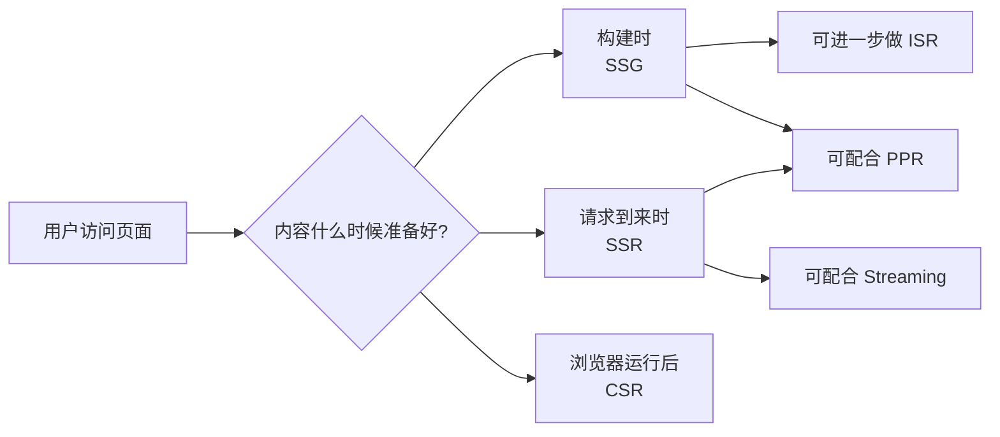
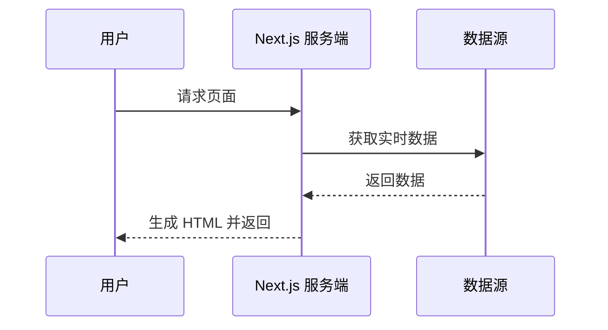
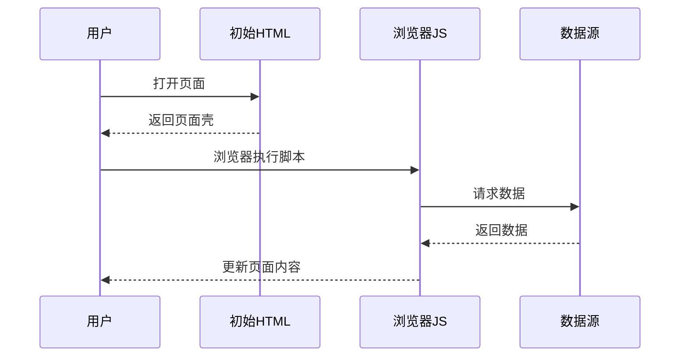
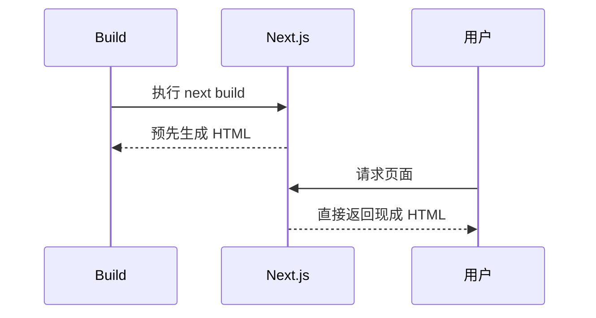
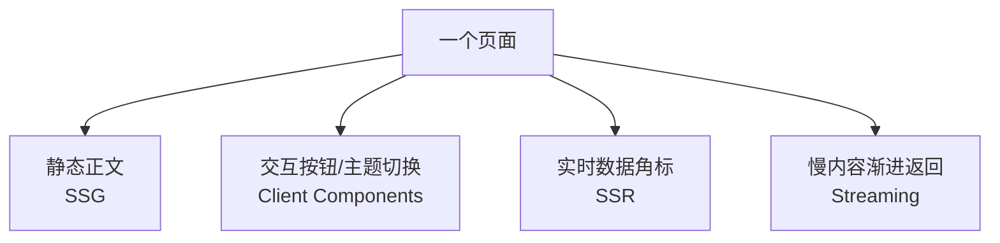
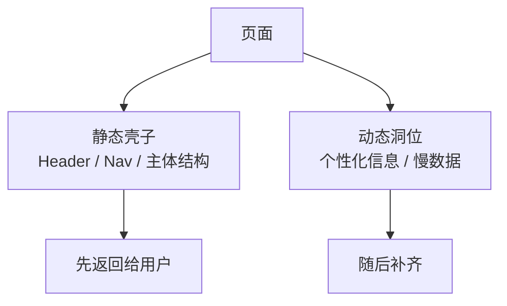
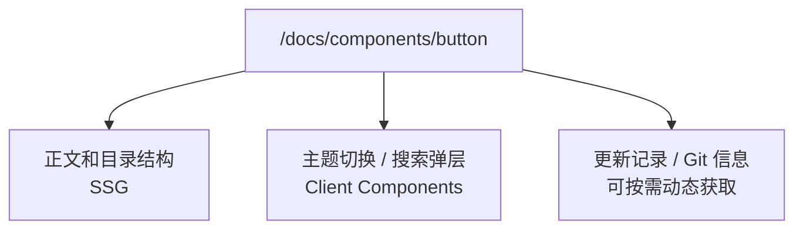

# 一文讲清 Next.js 里的 SSR、CSR、SSG、ISR、Streaming 与 PPR

很多人第一次学 Next.js 时，最容易混淆的就是这些名词：

- SSR
- CSR
- SSG
- ISR
- Streaming
- Partial Prerendering（PPR）

再加上 App Router、React Server Components、Client Components 这些概念一起出现，很多时候我们会把“渲染方式”“组件运行位置”“缓存策略”“页面生成时机”混在一起理解。

这篇文章的目标不是把概念堆满，而是把它们放回正确的位置：

1. `SSR / CSR / SSG` 到底分别是什么
2. 在 Next.js App Router 里应该怎么理解它们
3. `ISR / Streaming / PPR` 与前面三者是什么关系
4. 哪些概念容易混淆，应该如何区分
5. 最后给出一张实战对比表，帮助选型

## 零、先用一张图建立整体感觉

如果你现在只想快速抓住区别，可以先看这张图：



它表达的是一个非常朴素的事实：

- 如果内容在 `build` 阶段准备好，那它更偏 `SSG`
- 如果内容在请求到来时准备好，那它更偏 `SSR`
- 如果内容是在浏览器里准备好，那它更偏 `CSR`

## 一、先给结论：它们讨论的不是一件事

最核心的一点是：

- `SSR / CSR / SSG / ISR / PPR` 更偏页面生成或内容输出策略
- `Server Components / Client Components` 更偏组件运行位置与交互边界
- `Streaming` 更偏响应传输方式

也就是说，它们不是完全同一维度的概念。

如果只用一句话来概括：

- `SSR`：请求来了再生成 HTML
- `CSR`：先给壳，浏览器再拿数据和渲染
- `SSG`：构建时提前生成 HTML
- `ISR`：先静态生成，之后按规则增量更新
- `Streaming`：边准备内容边把内容流式返回
- `PPR`：静态外壳 + 动态区域的混合输出策略

这里再补一个非常重要的认知：

> 这些概念在现代 Next.js 项目里经常不是单选题。  
> 一个页面完全可能同时包含 SSG 的正文、CSR 的交互组件、SSR 的动态区域以及 Streaming 的输出方式。

## 二、SSR、CSR、SSG 分别是什么

### 1. SSR：Server-Side Rendering

`SSR` 的核心特征是：

**每次请求到来时，由服务器实时生成 HTML。**

这意味着：

- 页面内容可以是实时的
- 不同用户可能拿到不同的 HTML
- 首屏 HTML 是服务端现算出来的

适合的场景：

- 后台管理系统
- 登录态强相关页面
- 实时库存、订单、价格页
- 需要服务端权限判断的页面

优点：

- SEO 友好
- 首屏可直接拿到完整 HTML
- 适合实时数据

代价：

- 每次请求都要计算
- 服务端压力更大
- 响应时间可能受数据源影响

#### SSR 的运行流程



#### 一个典型的 SSR 示例

```tsx
export default async function Page() {
  const res = await fetch("https://api.example.com/orders", {
    cache: "no-store",
  });
  const orders = await res.json();

  return (
    <main>
      <h1>Orders</h1>
      <p>当前订单数：{orders.length}</p>
    </main>
  );
}
```

这里的关键点是 `cache: "no-store"`，它意味着每次请求都重新取数据，更符合 SSR 的心智模型。

### 2. CSR：Client-Side Rendering

`CSR` 的核心特征是：

**先返回一个前端壳子，真正的数据获取和界面更新发生在浏览器里。**

它的常见表现是：

- 初始 HTML 信息较少
- 浏览器加载 JS 后再请求数据
- 页面交互和状态主要在前端控制

适合的场景：

- 高交互工作台
- 实时筛选面板
- 强本地状态页面
- SEO 不敏感的内部系统

优点：

- 前端交互灵活
- 更适合复杂本地状态
- 页面局部更新自然

代价：

- 首屏可能出现 loading
- SEO 一般不如 SSR/SSG
- 对浏览器 JS 更依赖

#### CSR 的运行流程



#### 一个典型的 CSR 示例

```tsx
"use client";

import { useEffect, useState } from "react";

export default function Page() {
  const [stats, setStats] = useState<{ count: number } | null>(null);

  useEffect(() => {
    fetch("/api/stats")
      .then((res) => res.json())
      .then(setStats);
  }, []);

  if (!stats) {
    return <div>Loading...</div>;
  }

  return <div>Count: {stats.count}</div>;
}
```

这个例子里，真正的数据获取发生在浏览器端，所以更接近 CSR。

### 3. SSG：Static Site Generation

`SSG` 的核心特征是：

**在构建阶段就把页面提前生成为静态 HTML。**

也就是说，你在执行 `next build` 时，页面已经被生成好了，用户访问时直接拿现成结果。

适合的场景：

- 文档站
- 博客
- 官网
- 营销页
- 组件库文档

优点：

- 访问速度快
- 服务端压力低
- CDN 分发友好
- SEO 友好

代价：

- 数据不适合高频实时变化
- 内容更新通常依赖重新构建，或配合 ISR

#### SSG 的运行流程



#### 一个典型的 SSG 示例

```tsx
export async function generateStaticParams() {
  return [
    { slug: ["components", "button"] },
    { slug: ["components", "card"] },
  ];
}

export default async function Page({
  params,
}: {
  params: Promise<{ slug: string[] }>;
}) {
  const { slug } = await params;

  return <div>当前页面：{slug.join("/")}</div>;
}
```

如果这些动态路径在构建时就能确定，Next.js 就能提前把它们生成成静态页面。

## 三、为什么在 App Router 里这些概念更容易混

在 Next.js App Router 中，页面通常不是“纯 SSR”或“纯 CSR”那么简单。

一个页面很可能同时包含：

- 静态生成的正文
- 浏览器端的交互组件
- 服务端实时请求的数据块

例如一个文档页完全可能是：

- 文档正文：SSG
- 搜索框和主题切换：CSR
- 某个动态统计角标：SSR

这就是为什么在 App Router 里，**“页面级策略”和“组件级边界”必须分开看**。

可以把现代 App Router 页面理解成这样：



## 四、Server Components 和 Client Components 不是 SSR/CSR 的同义词

这是最容易误解的点之一。

### Server Components

Server Components 指的是：

**组件默认在服务器执行。**

它们可以：

- 直接取服务端数据
- 访问私密资源
- 减少发到浏览器的 JS

但它们不能直接用：

- `useState`
- `useEffect`
- `onClick`
- `window / document / navigator`

### Client Components

Client Components 指的是：

**显式使用 `"use client"`，让组件在浏览器里运行。**

它们可以：

- 用 React Hooks
- 做事件绑定
- 调浏览器 API

但它们并不等同于“整页 CSR”。

一个页面完全可以是：

- 外层 Server Component
- 内层局部 Client Component

所以更准确地说：

- `Server/Client Components` 是组件边界
- `SSR/CSR/SSG` 是页面内容生成策略

#### 一个混合页面的小例子

```tsx
// app/docs/page.tsx
import { ThemeToggle } from "./theme-toggle";

export default async function Page() {
  const docs = await getDocs();

  return (
    <main>
      <h1>{docs.title}</h1>
      <ThemeToggle />
    </main>
  );
}
```

```tsx
// app/docs/theme-toggle.tsx
"use client";

import { useState } from "react";

export function ThemeToggle() {
  const [theme, setTheme] = useState("light");

  return <button onClick={() => setTheme("dark")}>{theme}</button>;
}
```

这个例子里：

- 页面主体依然是 Server Component
- 但 `ThemeToggle` 是 Client Component

这不代表整个页面就变成了 CSR。

## 五、ISR：它到底算不算 SSG

`ISR` 全称是 `Incremental Static Regeneration`。

它可以理解为：

**SSG 的增强版。**

它的思路是：

1. 页面先静态生成
2. 之后在一定条件下重新生成
3. 不必每次都整站重新 build

所以 ISR 既保留了静态页面的高性能，也解决了纯 SSG 更新不够灵活的问题。

适合场景：

- 商品详情页
- 新闻列表页
- 内容更新频率中等的页面

它不等于 SSR，因为它不是每次请求都实时重新渲染；  
它也不等于传统纯 SSG，因为它允许后续增量更新。

#### 一个典型的 ISR 示例

```tsx
export const revalidate = 60;

export default async function Page() {
  const res = await fetch("https://api.example.com/posts");
  const posts = await res.json();

  return (
    <main>
      <h1>Blog</h1>
      <ul>
        {posts.map((post: { id: string; title: string }) => (
          <li key={post.id}>{post.title}</li>
        ))}
      </ul>
    </main>
  );
}
```

这里可以理解成：

- 页面先静态生成
- 每隔 60 秒允许重新生成一次

因此它更像“可更新的静态页面”。

## 六、Streaming：它不是新的“渲染种类”，而是传输方式

`Streaming` 很容易被误以为是第四种渲染方式，其实更准确地说，它是：

**把页面内容分块流式发送给浏览器的响应机制。**

它适合解决的问题是：

- 页面某些部分很快能出来
- 另一些部分比较慢
- 不希望用户一直等整页完成

因此你可以理解为：

- 页面某部分先返回
- 慢的部分稍后继续流给浏览器

所以 Streaming 更像一种“输出方式”，而不是对 SSG/SSR/CSR 的替代。

#### 一个典型的 Streaming 示例

```tsx
import { Suspense } from "react";

export default function Page() {
  return (
    <main>
      <h1>Dashboard</h1>
      <Suspense fallback={<div>Loading chart...</div>}>
        <SlowChart />
      </Suspense>
    </main>
  );
}

async function SlowChart() {
  const res = await fetch("https://api.example.com/chart", {
    cache: "no-store",
  });
  const chart = await res.json();

  return <pre>{JSON.stringify(chart, null, 2)}</pre>;
}
```

这里的重点不是“它是 SSR 还是 SSG”，而是：

**慢的部分不必阻塞整页，可以后续流式补上。**

## 七、PPR：为什么它最近常被拿出来单独讲

`PPR`，即 `Partial Prerendering`，可以理解成：

**静态外壳 + 动态内容洞位**。

它试图结合静态预渲染和动态渲染的优点：

- 能提前输出稳定的页面结构
- 又能为某些动态区域保留实时能力

所以它不是在否定 SSG 或 SSR，而是在做更细粒度的组合。

更直观地说：

- Header、导航、主体外壳可以提前静态输出
- 个别慢数据、个别个性化区域再动态填充

这是一种更接近实际产品需求的混合模式。

#### 用图理解 PPR



## 八、在 Next.js App Router 里，应该怎么理解“静态”和“动态”

如果你只记一个实用判断标准，可以记这个：

### 更偏静态（SSG）

- 内容发布后长期稳定
- 文档、博客、官网、组件库
- 可以在 build 时确定页面集合

### 更偏动态（SSR）

- 每次请求都可能不同
- 与用户身份、权限、实时数据高度相关

### 更偏客户端（CSR）

- 页面主要是前端交互
- 本地状态和浏览器能力是核心

### 更适合 ISR

- 页面总体稳定，但需要定期更新

### 更适合 Streaming / PPR

- 页面存在稳定部分和慢数据部分
- 希望尽快出首屏，而不是等整页

#### 一个实用判断公式

你完全可以先用下面这三个问题做初筛：

1. 这部分内容在 `build` 时能确定吗？
2. 这部分内容是不是每次请求都可能变？
3. 这部分内容是不是必须依赖浏览器交互？

然后对应到：

- 能提前确定：优先看 `SSG`
- 每次都可能变：优先看 `SSR`
- 依赖浏览器交互：优先看 `CSR / Client Components`

## 九、一个文档页的典型拆解

拿文档站来举例，最常见的组合其实是：

- 页面主体：SSG
- TOC、主题切换、搜索弹层：Client Components
- 某些辅助信息：按需动态获取

这也是为什么在现代 Next.js 项目里，“单选题思维”往往不够用了。  
很多页面不是简单地“选 SSR 还是 CSR”，而是组合使用。

#### 一个更完整的文档页示意



## 十、最容易犯的几个错误

### 错误 1：把 Server Component 理解成 SSR

不对。  
Server Component 只是说明组件运行在服务端，不等于页面必须是动态 SSR。

一个 Server Component 页面完全可以在 build 阶段静态生成。

### 错误 2：把 Client Component 理解成整页 CSR

也不对。  
一个 SSG 页面里照样可以嵌套 Client Component。

### 错误 3：认为 SSG 就一定不能更新

不对。  
加上 ISR 以后，静态页面是可以增量更新的。

### 错误 4：把 Streaming 当成新的页面渲染模式

更准确地说，它是响应输出机制，不是对 SSR/SSG/CSR 的简单替代。

## 十一、实战选型建议

如果你做的是：

### 文档站 / 博客 / 官网

优先考虑：

- `SSG`
- 必要时配合 `ISR`

### 后台 / 用户中心 / 实时业务页

优先考虑：

- `SSR`

### 高交互工作台 / 图表工具 / 浏览器状态很重的区域

优先考虑：

- `CSR`

### 页面同时有稳定内容和慢数据块

可以考虑：

- `Streaming`
- `PPR`

## 十二、总结：先分维度，再谈选型

如果你觉得这些概念复杂，通常不是因为概念本身难，而是因为我们把不同维度的问题放在一起谈了。

更好的理解方式是：

1. 先问页面内容是构建时生成、请求时生成，还是浏览器里生成
2. 再问组件是在服务端跑还是客户端跑
3. 最后再问是否要增量更新、流式输出、局部预渲染

这样思路就会清楚很多。

## 十三、对比表

| 模式/概念 | 主要含义 | 内容准备时机 | HTML 生成时机 | 适合场景 | 主要优点 | 主要代价 |
| --- | --- | --- | --- | --- | --- | --- |
| CSR | 浏览器端渲染 | 浏览器运行后 | 初始 HTML 较少，后续客户端补齐 | 高交互页面、内部系统、工具台 | 前端交互灵活 | 首屏可能慢，SEO 一般 |
| SSR | 请求时服务端渲染 | 每次请求时 | 每次请求时 | 实时数据页、权限页、后台 | 首屏完整、SEO 好、适合实时数据 | 服务端压力较高 |
| SSG | 构建时静态生成 | build 时 | build 时 | 文档、博客、官网、组件库 | 快、稳、适合 CDN、SEO 好 | 实时性较弱 |
| ISR | 增量静态再生成 | 首次 build + 后续增量更新 | 首次 build + 更新时再生成 | 内容更新频率中等的页面 | 兼顾静态性能与更新能力 | 机制更复杂 |
| Streaming | 流式输出响应 | 可分块准备 | 可分块返回 | 慢数据与快数据混合页面 | 更快展示可用内容 | 心智模型更复杂 |
| PPR | 部分预渲染 | 静态外壳 + 动态区域 | 混合 | 稳定外壳 + 动态洞位页面 | 平衡性能与动态能力 | 需要更细粒度设计 |
| Server Components | 服务端组件边界 | 服务端 | 取决于页面策略 | 数据获取、减少前端 JS | 更适合服务端逻辑 | 不能直接做浏览器交互 |
| Client Components | 客户端组件边界 | 浏览器 | 取决于页面策略 | 事件、状态、浏览器 API | 交互强 | JS 负担更高 |

## 参考资料

- Next.js Rendering: [https://nextjs.org/docs/app/building-your-application/rendering](https://nextjs.org/docs/app/building-your-application/rendering)
- Server and Client Components: [https://nextjs.org/docs/app/getting-started/server-and-client-components](https://nextjs.org/docs/app/getting-started/server-and-client-components)
- generateStaticParams: [https://nextjs.org/docs/app/api-reference/functions/generate-static-params](https://nextjs.org/docs/app/api-reference/functions/generate-static-params)
- generateMetadata: [https://nextjs.org/docs/app/api-reference/functions/generate-metadata](https://nextjs.org/docs/app/api-reference/functions/generate-metadata)
- Incremental Static Regeneration: [https://nextjs.org/docs/app/building-your-application/data-fetching/incremental-static-regeneration](https://nextjs.org/docs/app/building-your-application/data-fetching/incremental-static-regeneration)
- Partial Prerendering: [https://nextjs.org/docs/app/getting-started/partial-prerendering](https://nextjs.org/docs/app/getting-started/partial-prerendering)
