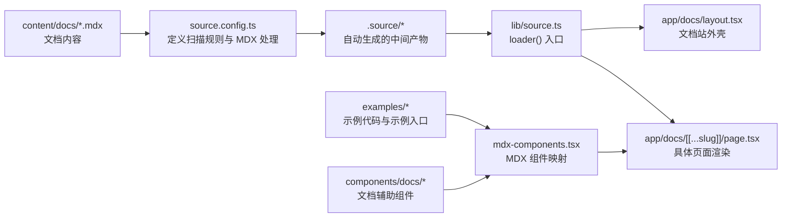

# Fumadocs 基础概念

## 简介

Fumadocs 是一个基于 Next.js 的文档体系和文档站解决方案。对我们这个项目来说，它更像一条“内容处理 + 页面组织 + 文档展示”的流水线，而不是单纯的 UI 组件库。

官方更准确的拆分方式是：

- `Fumadocs MDX`：官方内容源，用来把 `content/docs` 里的 Markdown / MDX / meta 文件编译成类型安全的数据
- `Fumadocs UI`：文档站的 UI 组件和布局组件
- `Fumadocs Core`：headless 能力，比如 `loader()`、page tree、TOC、source 接口等
- `Fumadocs CLI`：用于安装、定制和辅助生成

## 一句话理解

**Fumadocs = 内容文件 + 内容索引 + 页面外壳 + 页面渲染**

## 整体流程图



## 目录与文件职责

### `content/docs`

文档内容存储区，是真正写文章和页面的地方。这里放：

- `index.mdx`
- `components/*.mdx`
- `guides/*.mdx`
- `api/*.mdx`

### `meta.json`

`meta.json` 不是正文，而是当前层目录的导航说明。

它通常负责：

- 分组标题
- 页面顺序
- 当前层直接子节点的展示关系

例如：

```json
{
  "title": "Components",
  "pages": ["button", "card"]
}
```

这表示当前目录的 section 名称是 `Components`，并且 `button`、`card` 的展示顺序由这里控制。

### `source.config.ts`

这是 Fumadocs MDX 的配置入口，用来定义内容源和 MDX 处理规则。当前项目里它是最重要的“内容编译配置文件”。

建议在这里理解为三件事：

- `dir`：文档扫描目录
- `docs` / `meta`：内容集合定义
- `mdxOptions`：MDX 处理和高亮配置

### `.source`

`.source` 是 Fumadocs 在 `pnpm dev` 或 `pnpm build` 时自动生成的中间层。

它的作用是把：

- `source.config.ts` 里的规则
- `content/docs` 里的文件

整理成可直接 import 的映射结果。

它更像编译产物，不建议手改。

### `lib/source.ts`

这是站点运行时真正消费的 source 入口。

当前项目里的写法是：

```ts
import { loader } from "fumadocs-core/source";
import { docs } from "../.source/server";

export const source = loader({
  baseUrl: "/docs",
  source: docs.toFumadocsSource(),
});
```

这里要注意两点：

- `docs` 是 `.source/server` 自动生成的结果
- `loader()` 负责把它包装成 `getPage()`、`getPages()`、`pageTree`、`generateParams()` 这些能力

### `app/docs/layout.tsx`

这是文档站的外壳布局。它通常负责：

- 侧边栏
- 顶部导航
- 搜索入口
- 主题切换

在我们当前项目里，`DocsLayout` 接收的是 `source.pageTree`。

### `app/docs/[[...slug]]/page.tsx`

这是文档页的渲染入口。它会根据当前 slug 查到页面，然后交给 `DocsPage`、`DocsBody`、`DocsTitle` 这些组件排版。

### `mdx-components.tsx`

这是 MDX 组件映射表。

它负责告诉 MDX：

- `<Tabs />` 对应哪个组件
- `<Files />` 对应哪个组件
- `<ButtonBasicExampleShowcase />` 对应哪个组件

默认的 `fumadocs-ui/mdx` 会提供：

- `Cards`
- `Callout`
- `CodeBlock`
- `Headings`

但像 `Files`、`Tabs`、`Steps`、`Accordion`、`TypeTable`、`InlineTOC` 这类通常还要你显式注册。

## Fumadocs 的核心概念

### 1. Content Source

Fumadocs MDX 的目标不是做 CMS，而是把内容编译成类型安全数据。官方文档明确把它描述为一个内容处理层。

### 2. Source API

`loader()` 的作用是把内容源统一成一个适合框架调用的接口。它负责：

- 生成 page slug
- 构建 page tree
- 给页面分配 URL
- 提供 `getPage()`、`getPages()`、`generateParams()`

### 3. Page Tree

Page tree 是导航树，会被侧边栏、面包屑等组件使用。

官方也强调过它只包含必要信息，不适合塞函数或敏感数据。

### 4. MDX Components

MDX 中可以直接写 React 组件标签，但前提是你把它们加入组件映射。

### 5. Docs Layout / Docs Page

`DocsLayout` 管站点骨架，`DocsPage` 管单页排版。

## 你当前项目中的实际数据流

1. `content/docs` 存放 `.mdx` 和 `meta.json`
2. `source.config.ts` 定义内容集合和 MDX 规则
3. Fumadocs 自动生成 `.source/server.ts`
4. `lib/source.ts` 用 `docs.toFumadocsSource()` 和 `loader()` 暴露运行时 source
5. `app/docs/layout.tsx` 使用 `source.pageTree` 生成导航
6. `app/docs/[[...slug]]/page.tsx` 使用 `source.getPage()` 渲染正文
7. `mdx-components.tsx` 给 MDX 注册示例组件和 UI 组件

## 重要修正点

- `source.config.ts` 里建议使用 `defineDocs({ dir: "content/docs" })` 这类官方推荐写法
- `.source` 不是你手工维护的目录，而是构建/开发时生成的中间产物
- `loader()` 是 server-side API，不是浏览器侧 API
- `pageTree` 只保存导航所需的最小信息，不适合放大对象或函数
- `mdx-components.tsx` 除了注册组件，也可以用来支持相对链接等 MDX 行为

## 例子目录怎么理解

`examples/*` 建议只放“示例”：

- 基础用法示例
- 变体示例
- playground 示例

`components/docs/*` 建议只放“文档辅助组件”：

- 示例容器
- 标题区块
- 代码块包装
- 文档专用 UI

这两个目录不要和业务组件混用。

## 参考资料

- [Fumadocs MDX Getting Started](https://fumadocs.dev/docs/mdx)
- [Fumadocs Define Collections / Define Docs](https://fumadocs.dev/docs/mdx/collections)
- [Fumadocs Loader API](https://fumadocs.dev/docs/headless/source-api)
- [Fumadocs Page Tree](https://fumadocs.dev/docs/headless/page-tree)
- [Fumadocs Docs Layout](https://fumadocs.dev/docs/ui/layouts/docs)
- [Fumadocs Docs Page](https://fumadocs.dev/docs/ui/layouts/page)
- [Fumadocs Components](https://fumadocs.dev/docs/ui/components)
- [Fumadocs Files](https://fumadocs.dev/docs/ui/components/files)
- [Fumadocs Inline TOC](https://fumadocs.dev/docs/ui/components/inline-toc)

