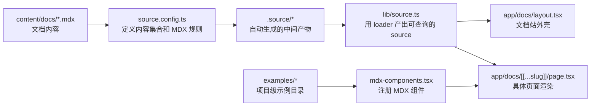
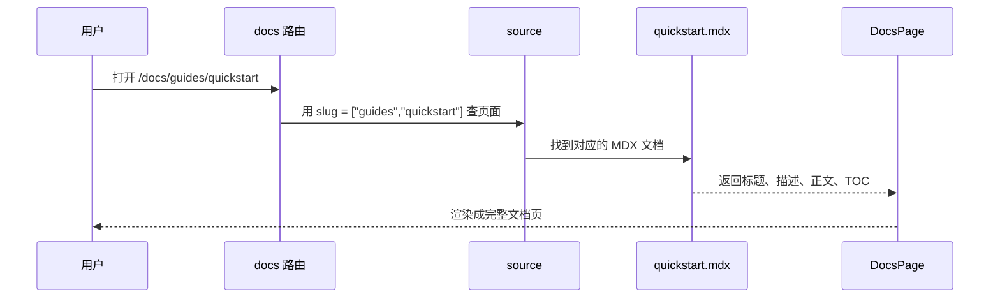

# Fumadocs 基础概念（修订版）

## 简介

Fumadocs 是一个面向 Next.js App Router 的文档工具链。它的目标不是做一个完整 CMS，而是把内容文件、页面索引、文档布局和 MDX 组件组合成一套适合文档站的工作流。

从官方文档看，Fumadocs 主要分成三块：

- `Fumadocs MDX`：官方内容源，负责把文档内容变成类型安全的数据
- `Fumadocs Core`：headless 层，负责 source、page tree、slug、loader 等基础能力
- `Fumadocs UI`：文档布局和组件层，负责页面壳子、侧边栏、TOC、Files、Cards 等 UI

`Fumadocs CLI` 则主要用于安装组件、定制布局、生成文件树等辅助工作。

## 一句话理解

**Fumadocs = 内容文件 + 内容配置 + 自动生成的 source + 文档布局 + 文档页面渲染**

## 总体流程



## Fumadocs 的组成

### Fumadocs MDX

Fumadocs MDX 是官方内容源，用来把 Markdown / MDX / JSON / YAML 等内容变成类型安全的数据。它不是一个完整 CMS，而是一个内容处理层。

官方推荐的最常见入口是 `source.config.ts` 里的 `defineDocs`：

```ts
import { defineConfig, defineDocs } from "fumadocs-mdx/config";

export const docs = defineDocs({
  dir: "content/docs",
});

export default defineConfig({
  mdxOptions: {
    rehypeCodeOptions: {
      themes: {
        light: "github-light",
        dark: "github-dark",
      },
    },
  },
});
```

如果是初学者文章，建议先写最简单的版本，不要一上来就加自定义 schema，除非你确实需要校验 frontmatter 或 `meta.json`。

### Fumadocs Core

Fumadocs Core 是 headless 层。它的 `loader()` 会把内容源转成统一接口，提供：

- `getPage()`
- `getPages()`
- `getPageTree()` / `pageTree`
- `generateParams()`

官方文档明确说明，`loader()` 是服务器端 API，不是浏览器端 API，也不是纯“构建时魔法”。

### Fumadocs UI

Fumadocs UI 负责页面布局和文档组件，常见的有：

- `DocsLayout`
- `DocsPage`
- `Files / Folder / File`
- `Cards / Card`
- `Steps / Step`
- `Tabs / Tab`
- `TypeTable`
- `Accordion / Accordions`
- `Callout`
- `CodeBlock`

它还提供默认 MDX 组件映射，可以直接给 MDX 页面使用。

### Fumadocs CLI

CLI 主要做三件事：

- 安装组件
- 定制布局
- 生成文件树展示组件

所以它不只是“安装 UI 组件”，而是一个围绕 Fumadocs 的辅助工具。

## `content/docs` 和 `meta.json`

`content/docs` 是文档内容的根目录。里面的 `.mdx` 文件就是正文，`meta.json` 则控制这一层的导航信息。

你现在这套结构，根目录示意可以这样理解：

```text
content/docs
├── meta.json
├── index.mdx
├── concepts/
│   ├── meta.json
│   └── core-concepts.mdx
├── api/
│   ├── meta.json
│   └── overview.mdx
├── guides/
│   ├── meta.json
│   ├── directory-structure.mdx
│   └── quickstart.mdx
└── components/
    ├── meta.json
    └── button.mdx
```

### `meta.json` 的作用

`meta.json` 不是正文，它更像“当前层的导航说明书”。

它会影响：

- 当前目录的展示标题
- 这一层是否默认展开
- 这一层能不能折叠
- 当前层直接孩子节点的顺序

一个典型例子：

```json
{
  "title": "Components",
  "pages": ["button", "card"],
  "defaultOpen": true
}
```

官方页面规则里，`pages` 默认按字母排序，但一旦你显式写了 `pages`，就会按你给的顺序来；同时，未列出的项不会自动混进来。

你需要特别注意的是，`pages` 主要描述“当前层的直接孩子”，不要把它理解成可以跨层随便引用整棵树里的任意页面。

除了 `title` 和 `pages`，官方还支持：

- `icon`
- `defaultOpen`
- `collapsible`
- `root`
- `description`

其中 `root` 会把目录标记成根目录，在某些布局里会作为顶层切换项处理。

## `source.config.ts`、`.source`、`lib/source.ts`

这三者常常被一起提到，但它们分工不同。

### `source.config.ts`

这是内容源配置入口，主要负责：

- 定义 `docs` 集合
- 指定内容目录
- 配置 doc/meta 的 schema
- 配置 MDX 编译选项

如果只是入门，不需要写很多东西，最小可用版通常就是：

```ts
import { defineConfig, defineDocs } from "fumadocs-mdx/config";

export const docs = defineDocs({
  dir: "content/docs",
});

export default defineConfig({});
```

### `.source`

`.source` 是 Fumadocs 在 `pnpm dev` 或 `pnpm build` 时自动生成的中间产物。

它不是你手写的业务代码，而是由 Fumadocs MDX 插件根据 `source.config.ts` 和内容目录生成的映射文件。你只需要消费它，不要手改它。

在实际项目里，`.source` 通常应该加入 `.gitignore`。

### `lib/source.ts`

`lib/source.ts` 是运行时真正消费内容 source 的地方。

你当前项目里这段写法是正确的：

```ts
import { loader } from "fumadocs-core/source";
import { docs } from "../.source/server";

export const source = loader({
  baseUrl: "/docs",
  source: docs.toFumadocsSource(),
});
```

这里的关键点是：

- `docs` 已经是经过 `source.config.ts` 和 Fumadocs 生成流程处理过的集合
- `docs.toFumadocsSource()` 会把它转换成 `loader()` 所需的 source
- `loader()` 再把它包装成 `getPage()`、`pageTree`、`generateParams()` 等能力

换句话说，`source.config.ts` 负责“定义规则”，`lib/source.ts` 负责“消费结果”。

## `app/docs/layout.tsx` 和 `app/docs/[[...slug]]/page.tsx`

### `app/docs/layout.tsx`

这是文档站外壳。它一般负责：

- 传入 `source.pageTree` 给 `DocsLayout`
- 配置导航标题、链接、主题、搜索
- 维持整个 docs 站点统一壳子

官方建议把共享配置抽到一个独立的 `layout.shared.tsx` 再复用。

### `app/docs/[[...slug]]/page.tsx`

这是具体文档页的渲染入口。它负责：

- 根据 slug 查页面
- 输出标题、描述、正文
- 传入 TOC
- 配置 `full`、footer、breadcrumb、TOC 样式等

你现在这套结构是标准的 App Router 写法。

一个比较推荐的写法是：

```tsx
import { DocsBody, DocsDescription, DocsPage, DocsTitle } from "fumadocs-ui/layouts/docs/page";
```

如果你想让 TOC 变成图二那种弯曲轨迹，官方已经支持在 `DocsPage` 里设置：

```tsx
<DocsPage
  tableOfContent={{
    style: "clerk",
  }}
/>
```

## `mdx-components.tsx`

这是 MDX 组件映射表，作用是把 Markdown 语法里写出来的自定义标签，映射成真正的 React 组件。

你当前项目里这类用法是合理的：

- `Tabs` / `Tab`
- `Files` / `Folder` / `File`
- `TypeTable`
- 自定义 `ExampleShowcase`
- 自定义 example 组件

官方默认的 `fumadocs-ui/mdx` 只覆盖部分基础组件，通常包括 Cards、Callouts、Code Blocks 和 Headings。  
所以最稳妥的方式是：

```ts
import defaultMdxComponents from "fumadocs-ui/mdx";

export function useMDXComponents(components: MDXComponents): MDXComponents {
  return {
    ...defaultMdxComponents,
    ...components,
  };
}
```

如果你的 MDX 文件里会写相对路径链接，比如 `[Next]("./other-page.mdx")`，官方建议在服务端通过 `createRelativeLink(source, page)` 覆盖 `a` 标签。

这点在 beginner 文章里最好补一句，因为很多人第一次会以为 relative link 只是普通 Markdown 链接，但在 Fumadocs 里它和 source 解析是关联的。

## `examples/*`

`examples/*` 不是 Fumadocs 官方强制要求的目录，而是你这个项目自己的约定。

它很适合放：

- 某个组件的基础使用示例
- 代码字符串
- 示例包装器
- 组合 `preview + code` 的展示组件

建议在文章里把它解释成“项目级示例目录”，避免读者以为这是 Fumadocs 固定规范。

## 运行流程

当用户打开 `/docs/guides/quickstart` 时，流程大致是：



## 容易写错的地方

- `source.config.ts` 不是“随便放插件”的地方，它主要是内容集合和 MDX 配置入口。
- `.source` 不是业务代码，应该视为生成产物。
- `lib/source.ts` 不是重新定义文档规则，而是消费 `docs.toFumadocsSource()`。
- `meta.json` 不是正文，它只管当前层导航。
- `pages` 主要控制当前层直接孩子的顺序，不要把它写成跨层导航总表。
- `mdx-components.tsx` 不只是“注册组件”，还常常负责补默认 MDX 组件和相对链接处理。
- `examples/*` 是项目约定，不是官方固定目录。

## 建议补充的内容

如果你想让这篇文档更完整，建议再补两小节：

- `DocsLayout` 和 `DocsPage` 的常用参数
- 你项目里 `searchToggle`、`tableOfContent`、`full`、`layout.shared.tsx` 的作用

## 参考

- [Fumadocs MDX Getting Started](https://www.fumadocs.dev/docs/mdx)
- [Fumadocs MDX Collections](https://www.fumadocs.dev/docs/mdx/collections)
- [Fumadocs Core Loader API](https://www.fumadocs.dev/docs/headless/source-api)
- [Fumadocs Page Slugs & Page Tree](https://www.fumadocs.dev/docs/headless/page-conventions)
- [Fumadocs Docs Page](https://www.fumadocs.dev/docs/ui/layouts/page)
- [Fumadocs Docs Layout](https://www.fumadocs.dev/docs/ui/layouts/docs)
- [Fumadocs Components](https://www.fumadocs.dev/docs/ui/components)
- [Fumadocs CLI](https://www.fumadocs.dev/docs/cli)
