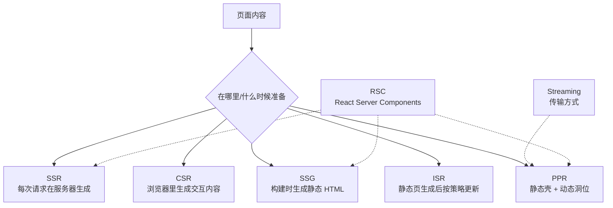

# Next.js 渲染方式全景：SSR、CSR、SSG、ISR、PPR 和 Streaming 怎么区分

在 Next.js 里，很多人会把 SSR、CSR、SSG、ISR 混在一起讲，但它们其实不在同一个维度上。更准确地说，有些是“渲染策略”，有些是“缓存/再验证机制”，还有些是“传输方式”或“组件模型”。

如果你正在写文档站、博客、营销页或者组件库官网，这几个概念一定要分清楚。它们直接决定了页面是何时生成、在哪里执行、能不能缓存、SEO 效果如何，以及是否适合实时数据。

## 先看结论

最常见的三种渲染方式是：

- `SSR`：服务器在每次请求时生成 HTML
- `CSR`：浏览器在拿到基础壳后再运行 JS 渲染页面
- `SSG`：构建时提前生成 HTML，用户访问时直接复用

除此之外，Next.js 里还常见这些相关概念：

- `ISR`：静态页面生成后，再按策略增量更新
- `PPR` / `Cache Components`：静态壳 + 动态洞位的混合渲染
- `Streaming`：把页面分块逐步传给客户端
- `React Server Components`：一种组件模型，是 App Router 的基础能力，不是单独的渲染模式

## 一张图先理解

## 1. SSR

SSR 是 `Server-side Rendering`，Next.js 官方也常把它称为 `Dynamic Rendering`。核心意思是：HTML 在服务器端按请求生成，用户每次访问都可能拿到不同结果。

它适合：

- 登录态页面
- 个性化内容
- 依赖 cookies、headers、searchParams 的页面
- 实时数据面板

在 App Router 里，SSR 更常表现为“服务端动态渲染”，而不是老 Pages Router 时代的 `getServerSideProps` 写法。

### 适合 SSR 的场景

- 用户资料页
- 后台控制台
- 订单详情页
- 需要实时刷新、且不适合缓存的内容

### 不适合 SSR 的场景

- 内容稳定的博客
- 文档站首页
- 产品介绍页
- 不需要每次请求都重算的页面

## 2. CSR

CSR 是 `Client-side Rendering`，页面的主要内容在浏览器里通过 JavaScript 生成。Next.js 官方对 CSR 的描述很明确：浏览器会先拿到最小 HTML，再下载并执行 JS，最后把页面渲染完整。

它适合：

- 强交互页面
- 浏览器本地状态重的界面
- 搜索、筛选、拖拽、看板
- 不强依赖 SEO 的应用区域

### CSR 的特点

- 首屏通常比 SSG/SSR 慢
- 交互性强
- 更依赖浏览器 JS
- SEO 通常不如服务端预渲染友好

在 Next.js App Router 里，`"use client"` 的组件就是典型的 CSR 交互入口，但要注意：首屏 HTML 仍然会在服务器上生成一份非交互预览，真正的交互和状态是在浏览器里接管的。

## 3. SSG

SSG 是 `Static Site Generation`，也就是构建时生成静态 HTML。页面在部署前就已经准备好，用户访问时可以直接复用。

它适合：

- 文档站
- 博客
- 官网
- 营销页
- 组件库站点

### SSG 的优点

- 首屏快
- 缓存友好
- SEO 友好
- 适合大量稳定内容

### SSG 的实现线索

在 App Router 里，常见做法是：

- 动态路由配合 `generateStaticParams()`
- 页面数据来源稳定
- 页面渲染可在构建期完成

像你现在的 docs 路由，就是很典型的 SSG 候选。

## 4. ISR

ISR 是 `Incremental Static Regeneration`，中文常叫“增量静态再生成”。

它的核心不是一种全新的渲染模式，而是：

**静态页面先生成出来，然后在后续按策略增量刷新。**

Next.js 官方文档强调它适合：

- 不想每次都重新构建整个站点
- 内容会更新，但不需要秒级实时
- 页面数量很多

### ISR 和 SSG 的关系

ISR 可以理解成“SSG + 再验证”。

- 第一次仍然是静态生成
- 之后按 `revalidate`、`revalidatePath`、`revalidateTag` 等策略更新

所以文章里最好把 ISR 放在 SSG 之后讲，而不是和 SSR、CSR 并列成完全相同层级。

## 5. PPR / Cache Components

PPR 是 `Partial Prerendering`，在当前 Next.js 官方文档里，它和 `Cache Components` 是强相关的一组概念。可以把它理解成：

**一个页面里同时存在静态壳和动态洞位。**

它适合：

- 页面大部分稳定，但局部需要实时/个性化
- 希望首屏快，同时保留动态能力

### 你可以怎么表述

建议不要把 PPR 直接写成“第四种和 SSR/CSR/SSG 完全平级的渲染模式”，更准确的说法是：

- 它是一种混合策略
- 它把静态预渲染、Suspense、流式传输和缓存能力组合在一起

## 6. Streaming

Streaming 不是单独的渲染模式，更像是“交付方式”。

Next.js 官方会把它和 Server Components、Suspense、PPR 联系起来讲。它的核心是：

- 页面不必等所有内容都准备好才一次性返回
- 可以先发静态壳，再把动态部分逐块流式传输

### 适合怎么写

你可以把 Streaming 写成：

**一种把页面逐步发送给浏览器的传输机制，常和 SSR、RSC、PPR 一起出现。**

## 7. React Server Components

React Server Components，简称 `RSC`，也不是一种单独的渲染模式。

它更像是 App Router 的基础组件模型：

- 默认情况下，`app` 下的页面和布局是 Server Components
- 需要交互时再通过 `"use client"` 引入 Client Components
- RSC 负责把服务器组件树转换成可传输的 payload

### 写文章时的建议

不要把 RSC 直接和 SSR、CSR、SSG 放成完全同维度的“渲染方式”。
更准确的说法是：

- `SSR / SSG / ISR / PPR` 更接近“页面如何被生成/缓存”
- `RSC` 是“组件如何在服务器和客户端之间协作”

## 8. 常见误区

### 误区 1：SSR 就一定不缓存

不一定。Next.js 的 App Router 里，页面可能是动态渲染，但局部数据仍然可以缓存。不能把“SSR”和“完全不缓存”画等号。

### 误区 2：CSR 就是纯前端 SPA

也不完全是。Next.js 的 Client Components 仍然会先拿到一份首屏 HTML 预览，然后再在浏览器里接管交互。

### 误区 3：SSG 就永远不会更新

不对。ISR 本质上就是在静态生成之后继续更新它。

### 误区 4：Streaming 是一种和 SSR/SSG 平级的模式

不对。它更像是交付和渲染协作机制。

### 误区 5：RSC 等于 SSR

不对。RSC 是组件模型，SSR 是渲染策略。

## 9. 怎么选

- 内容稳定、追求性能和 SEO，优先 SSG
- 内容会更新但不需要秒级，考虑 SSG + ISR
- 需要每次请求都根据用户或请求上下文变化，考虑 SSR
- 高交互、浏览器状态复杂的区域，考虑 CSR
- 大页面里既想快，又想局部动态，考虑 PPR / Cache Components

## 10. 对比表

| 概念 | 类型 | 内容何时准备 | 主要运行位置 | 适合场景 | 备注 |
|---|---|---|---|---|---|
| CSR | 渲染方式 | 浏览器加载 JS 后 | 客户端 | 强交互页面 | SEO 和首屏通常不占优 |
| SSR | 渲染方式 | 每次请求时 | 服务器 | 个性化、实时数据 | Next.js 官方也常称 Dynamic Rendering |
| SSG | 渲染方式 | 构建时 | 服务器 | 文档、博客、官网 | 静态 HTML 可被直接复用 |
| ISR | 再生成策略 | 构建后按策略更新 | 服务器 | 稳定但会更新的内容 | 可以视作 SSG 的增量更新 |
| PPR / Cache Components | 混合策略 | 静态壳 + 动态洞位 | 服务器 + 客户端 | 静态与动态并存页面 | 更接近组合机制，不是单一传统模式 |
| Streaming | 传输机制 | 分块逐步返回 | 服务器 -> 客户端 | 大页面、动态块较多 | 常和 Suspense、RSC 一起出现 |
| RSC | 组件模型 | 服务器渲染组件树 | 服务器 + 客户端协作 | App Router 默认架构 | 不是单独的渲染模式 |

## 参考资料

- [Next.js Server and Client Components](https://nextjs.org/docs/app/building-your-application/rendering/server-components)
- [Next.js Caching and Revalidating](https://nextjs.org/docs/app/building-your-application/data-fetching/caching)
- [Next.js ISR](https://nextjs.org/docs/app/building-your-application/data-fetching/incremental-static-regeneration)
- [Next.js Cache Components / PPR](https://nextjs.org/docs/app/getting-started/cache-components)
- [Next.js CSR](https://nextjs.org/docs/pages/building-your-application/rendering/client-side-rendering)
- [Next.js SSR](https://nextjs.org/docs/pages/building-your-application/rendering/server-side-rendering)

